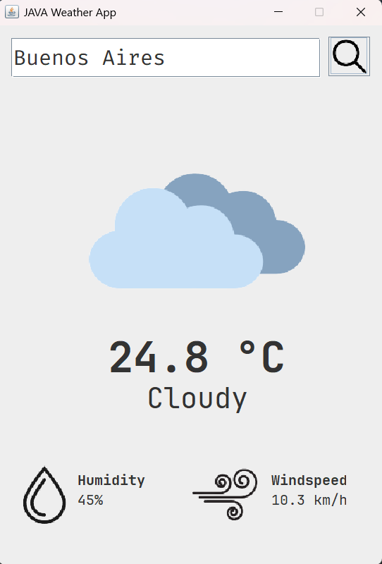

# 🌤️ Java Weather App

A desktop weather application developed in **Java Swing** that retrieves real-time climate data using the **Open-Meteo API**.  
The application allows users to search for a city and displays current weather conditions such as temperature, humidity, wind speed, and visual indicators based on the weather status.

This project was built as part of a personal Java portfolio, focusing on API integration, GUI development, and clean code organization.

---

## 📸 Screenshot

<p align="center">
  
</p>

---

## ✨ Features

- 🔍 Search weather information by city name  
- 🌡️ Displays current temperature in Celsius (°C)  
- 💧 Shows relative humidity percentage  
- 💨 Displays wind speed in km/h  
- ☁️ Dynamic weather icons (Clear, Cloudy, Rain, Snow)  
- ⚠️ Error handling for invalid locations or API issues  
- 🖥️ Built with Java Swing and executed on the Event Dispatch Thread (EDT)

---

## 🧱 Project Structure

```
weatherapp/
├── AppLauncher.java           # Application entry point
├── WeatherAppGUI.java         # Swing graphical user interface
│
├── api/
│   └── WeatherAPIService.java # API integration and data processing
│
├── assets/
│   ├── clear.png
│   ├── cloudy.png
│   ├── rain.png
│   ├── snow.png
│   ├── humidity.png
│   ├── windspeed.png
│   └── search.png
```

---

## 🛠️ Technologies Used

- **Java 17+**
- **Java Swing**
- **Open-Meteo API**
- **JSON Simple**
- **HTTPURLConnection**

---

## 🚀 How to Run

1. Clone this repository:
   ```bash
   git clone https://github.com/your-username/java-weather-app.git
   ```

2. Open the project in **NetBeans** or your preferred Java IDE

3. Make sure the `json-simple` library is added to the project libraries

4. Run the `AppLauncher` class

---

## 🧠 What I Learned

- Consuming REST APIs in Java
- Parsing JSON responses using json-simple
- Building desktop applications with Java Swing
- Managing the Event Dispatch Thread (EDT)
- Handling API errors and null-safe UI updates
- Organizing a Java project into logical packages

---

## 📌 Future Improvements

- Introduce a `WeatherData` model class
- Improve UI/UX (loading indicator, Enter key search, dark mode)
- Add timezone handling (`timezone=auto`)
- Cache results to reduce API calls
- Improve error feedback and validations

---
## 📚 References

This project was developed as a hands-on learning exercise based on a public tutorial, and later extended with custom improvements and debugging.

- Original tutorial by: **Traversy Media**
- Source: YouTube  
- Link: https://www.youtube.com/watch?v=8ZcEYv2ezWc&t=1435s
